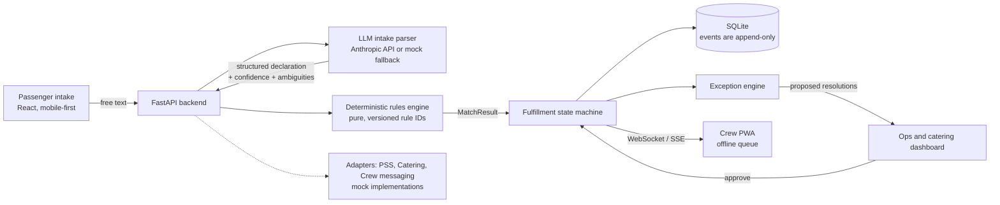

# SKY Plate

### Closed-loop dietary safety and fulfillment for in-flight service

> From *declared need* → *verified meal* → *seat* → *crew action* → *closed loop*.


<!-- Add a hero screenshot or GIF of the crew seat map here -->
<!--  -->

---

## Table of Contents

- [The Problem](#the-problem)
- [Our Solution](#our-solution)
- [What Makes SkyChain Different](#what-makes-skychain-different)
- [Core Safety Principles](#core-safety-principles)
- [Features](#features)
- [Architecture](#architecture)
- [Tech Stack](#tech-stack)
- [Getting Started](#getting-started)
- [Running Tests](#running-tests)
- [Demo Scenario](#demo-scenario)
- [Rules Engine](#rules-engine)
- [Project Structure](#project-structure)
- [Integration Adapters (Mocks)](#integration-adapters-mocks)
- [Security, Privacy and Data Retention](#security-privacy-and-data-retention)
- [Competitive Positioning](#competitive-positioning)
- [Known Limitations](#known-limitations)
- [Roadmap](#roadmap)
- [Team](#team)

---

## The Problem

Airlines already have strong catering planning tools and passenger special-meal request forms. The gap is the **link between them**.

- A passenger's dietary need or severe allergy gets lost between the booking engine, the catering order and the cabin crew.
- Nothing proves that a declared need was **received, validated, matched, confirmed by catering, loaded, briefed to crew and served**.
- When something changes late (a seat swap, a catering batch change, a late booking), there is no system that re-checks affected passengers and tells the right crew member at the right seat what to do.

The result is operational liability and real medical risk at 35,000 feet, where help is far away.

## Our Solution

Skyplate is a **Dietary Fulfillment Chain**. It is *not* a meal-booking app and *not* a catering forecaster. It tracks every passenger's dietary need through eight stages and raises a specific, actionable alert whenever a step fails.

```
DECLARED → VALIDATED → MATCHED → CATERING_CONFIRMED → LOADED → CREW_BRIEFED → SERVED → CLOSED
                                       (any failure) ↘ EXCEPTION
```

Every transition is an immutable, timestamped audit event, so the full story of each passenger's meal can be replayed.

## What Makes Skyplate Different

| Differentiator | What it means |
|---|---|
| **Declared vs. verified** | A passenger's declared allergy is never treated as equivalent to a verified meal ingredient record. They are separate concepts in the data model and the UI. |
| **LLM extracts, rules decide** | The LLM only parses messy text into structured data and suggests. A deterministic, tested rules engine makes every safety decision. |
| **Closed-loop chain** | Each need is tracked from declaration to closure, with an owner role at every stage and a failure path to `EXCEPTION`. |
| **Exception engine** | Late adds, seat changes, batch changes, unavailable meals and code mismatches trigger re-matching and propose resolutions that need human approval. |
| **Fail-safe by default** | Unknown or unverified is never shown as safe. |

## Core Safety Principles

These are enforced in code and surfaced in the UI and docs:

1. **Declared ≠ verified.** A declared allergy is not the same as a verified ingredient record.
2. **The LLM never decides safety.** It extracts and suggests only.
3. **Fail-safe default.** Unknown or unverified is never shown as safe.
4. **Immutable audit log.** Every state change is a timestamped, append-only event.
5. **Role-scoped data.** Crew see only what they need for service.
6. **No guarantees.** SkyChain *supports crew decisions*. It never claims an "allergen-free" guarantee.
7. **"Safe" means one thing.** Nothing is marked safe in code or UI unless the rules engine explicitly returns `CONFIRMED_SAFE`.

## Features

### Passenger Intake (mobile-first)
- Free-text box plus quick-select chips
- Supports English, Hindi, Punjabi and Hinglish (e.g. *"bina pyaaz lehsun ke Jain khana chahiye"*)
- Live parsed preview with confidence score and flagged ambiguities
- Confirmation step before submission
- Plain-language status tracker for the passenger's chain stage
- Honest disclaimer: requests are supported, but allergen-free environments cannot be guaranteed

### Crew App (PWA)
- Installable, offline-capable, with an offline queue that syncs on reconnect and a visible sync indicator
- Dark-cabin mode with large touch targets
- Color-coded seat map (never color alone: icons and labels too)
- Severity-sorted task list showing what is confirmed, what is unresolved and the required action
- One-tap acknowledge and resolve, each timestamped and logged
- Search by seat or name; filter by severity and status
- Live alerts over WebSockets/SSE

### Catering and Ops Dashboard
- Special-meal counts per flight
- Chain-stage funnel and countdown to departure
- Exception queue with approve actions
- Human review queue for low-confidence parses

### Impact Dashboard
- Percent of requests with a complete chain
- Unresolved high-severity items at T-24h / T-6h / T-1h
- Meal mismatch rate and average time-to-resolution
- Estimated waste avoided from special-meal buffer sizing
- **All figures are simulated and labelled with published assumptions**

### Audit Timeline
- Per-passenger, chronological log of who did what and when

## Architecture



**Key idea:** the LLM sits at the *edge* (parsing only). Everything that affects safety passes through the pure rules engine and the explicit state machine.

## Tech Stack

| Layer | Technology |
|---|---|
| Frontend | React, TypeScript, Vite, Tailwind CSS |
| Crew app | Progressive Web App with local cache and sync-on-reconnect |
| Backend | Python, FastAPI, Pydantic |
| Database | SQLite via SQLAlchemy |
| Realtime | WebSockets (or SSE) |
| LLM | Pluggable provider interface; default Anthropic API, with a deterministic mock parser fallback |
| Forecasting (optional) | scikit-learn quantile regression or a simple statistical model |
| Testing | pytest (backend), Vitest (frontend logic) |
| Tooling | Makefile / docker-compose for one-command setup |

## Getting Started

### Prerequisites

- Python 3.11+
- Node.js 20+
- (Optional) Docker and docker-compose
- (Optional) An Anthropic API key. **Not required:** without one, SkyChain uses the built-in mock parser so the demo always runs offline.

### Quick start

```bash
# 1. Clone
git clone https://github.com/<your-org>/skychain.git
cd skychain

# 2. Configure environment
cp .env.example .env
# Optional: add ANTHROPIC_API_KEY to .env to use the real LLM parser

# 3. Install, seed the database and start everything
make dev
```
> The exact commands and ports above are the intended defaults. Adjust them to match your `Makefile` and Vite config.

### Docker alternative

```bash
docker-compose up --build
```

### Seeding data manually

```bash
make seed
```

This generates one synthetic Delhi to London flight (~160 passengers, economy and business), 8-10 meals with ingredient records, and a realistic dietary mix:

- ~25-30% special meals (vegetarian, Jain, halal, diabetic, gluten-free, low-lactose, child meals)
- A handful of severe allergies (peanut, tree nut, shellfish, sesame)
- Messy free-text declarations in English, Hindi and Hinglish, plus a few ambiguous cases

**All data is synthetic. There is no real PII anywhere in this repository.**

## Running Tests

```bash
# Backend: rules engine and state machine
make test-backend      # pytest

# Frontend: key logic
make test-frontend     # Vitest

# Everything
make test
```

The rules engine has 40+ test cases covering synonyms, hierarchies, cross-contact, severity differences, multi-allergen passengers, religious ambiguity, missing records and late changes. It includes **property-style tests**: a meal containing a declared allergen must *never* produce `CONFIRMED_SAFE`.

## Demo Scenario

Trigger it with the **Run demo** button in the app, or via script.

1. A passenger submits a messy request that includes a severe allergy.
2. The parser extracts it and flags an ambiguity; the passenger confirms.
3. The rules engine returns `SAFE_CROSS_CONTACT_NOT_ASSESSED`; catering confirms and the chain advances.
4. **Disruption:** a catering batch change or seat change turns the match into `CONFLICT`.
5. The exception engine raises a `CRITICAL` alert on the crew app at the correct seat with a specific action. Crew acknowledges; ops approves a substitute meal.
6. The audit timeline shows the full story and the impact dashboard updates.

**2-minute pitch script:** see [`docs/demo-script.md`](docs/demo-script.md).

## Rules Engine

A pure, side-effect-free module with versioned rule IDs. Input: a dietary declaration, a candidate meal and its ingredient record. Output: a `MatchResult` with reasons and triggered rule IDs.

**Possible statuses:** `CONFIRMED_SAFE`, `SAFE_CROSS_CONTACT_NOT_ASSESSED`, `UNVERIFIED`, `CONFLICT`, `NO_SUITABLE_MEAL`.

| Rule | Summary |
|---|---|
| R1 | Declared allergen present in ingredients or declared allergens → `CONFLICT` |
| R2 | Allergen in *may contain* → `CONFLICT` if severe, otherwise `SAFE_CROSS_CONTACT_NOT_ASSESSED` with warning |
| R3 | Missing record or cross-contact not assessed → at best `SAFE_CROSS_CONTACT_NOT_ASSESSED`; no record → `UNVERIFIED` |
| R4 | Religious/dietary restrictions checked against ingredient tags; ambiguous items (gelatin, rennet, alcohol-based flavorings) → `UNVERIFIED` |
| R5 | Synonym and hierarchy handling (groundnut = peanut; "tree nuts" expands; "dairy" includes whey, casein, ghee, paneer; "gluten" includes wheat, barley, rye) |
| R6 | Severe allergy and no suitable meal → `NO_SUITABLE_MEAL` with `CRITICAL` alert and escalation |
| R7 | Low parse confidence or unresolved ambiguity → human review, never auto-accepted |
| R8 | Party handling: child/family declarations apply to the right passenger and link the parent's seat |
| R9 | Anything unknown defaults to `UNVERIFIED` |

Full rationale for each rule lives in [`docs/rules.md`](docs/rules.md).

## Project Structure

```
skychain/
├── backend/
│   ├── app/
│   │   ├── api/              # FastAPI routes, role-based access
│   │   ├── models/           # SQLAlchemy and Pydantic models
│   │   ├── rules/            # Deterministic rules engine
│   │   ├── fulfillment/      # State machine and audit events
│   │   ├── exceptions/       # Exception engine
│   │   ├── intake/           # LLM parser and mock fallback
│   │   ├── adapters/         # Mock PSS / catering / crew messaging
│   │   └── forecast/         # Optional buffer forecast module
│   ├── prompts/
│   │   └── intake_parser.md  # Full parser system prompt and few-shot examples
│   ├── seed/                 # Synthetic data generator
│   └── tests/                # pytest suite
├── frontend/
│   ├── src/
│   │   ├── passenger/        # Intake UI
│   │   ├── crew/             # PWA: seat map, alerts, offline queue
│   │   ├── ops/              # Ops, review queue, impact, audit timeline
│   │   └── lib/
│   └── tests/                # Vitest
├── docs/
│   ├── rules.md
│   ├── demo-script.md
│   ├── architecture.md
│   └── screenshots/
├── .env.example
├── docker-compose.yml
├── Makefile
└── README.md
```

## Integration Adapters (Mocks)

SkyChain is designed to **integrate, not replace**. Clean ports/adapters interfaces exist for:

- `PassengerServiceSystem`: booking and manifest
- `CateringSystem`: meal plans and ingredient records
- `CrewMessaging`: crew notifications

> **These are mock implementations.** Skyplate does **not** claim any real integration with any airline system or catering provider. The adapter layer shows where a real airline or catering-system integration would plug in. Mocks are labelled as such in the UI.

## Security, Privacy and Data Retention

- Role-based access on every endpoint (`passenger`, `catering`, `crew`, `ops_admin`); crew endpoints return the minimum data needed for service
- Input validation and rate limiting on the intake endpoint
- No secrets committed; use `.env.example` as the template
- All demo data is synthetic and contains no real PII
- UI copy avoids guarantee language ("supports crew decisions")

**Consent and retention assumptions (for a real deployment):**
- Dietary and allergy data is health-related and sensitive. It would need explicit passenger consent and a lawful basis under applicable law (for example GDPR for UK/EU routes, or India's DPDP Act).
- Data should be retained only as long as needed for the flight and a defined audit window, then deleted or anonymized.
- This prototype implements none of the legal or compliance machinery. It is a demonstration.

## Competitive Positioning

Catering planning vendors such as **Paxia, gategroup and LSG** already cover catering planning and meal production. SkyChain does not compete on that. It focuses on the **passenger-to-crew safety chain**: proving that each declared need was received, verified, matched, loaded and served, and acting when it breaks. It is built to sit alongside those systems and integrate with them.

## Known Limitations

- Prototype only; **not certified or validated for real-world allergen safety use**
- All integrations are mocks; all data is synthetic
- The mock parser is keyword and synonym based and less capable than the LLM parser
- Impact numbers are simulated and based on stated assumptions, not measured results
- Rules cover a representative allergen and religious-diet set, not every regulatory allergen list or regional cuisine
- Offline sync handles a simple queue; complex multi-device conflict resolution is out of scope
- SQLite is used for easy setup, not production scale
- No guarantee of an allergen-free environment, and none is implied anywhere in the product

## Roadmap

- [ ] Optional: special-meal buffer forecast (P50/P90 quantiles vs. naive baseline). Forecasts will **never** override or suppress an individual allergy alert or match result.
- [ ] Real integration pilots through the adapter layer
- [ ] Expanded allergen and regional diet knowledge base, reviewed by food-safety experts
- [ ] More languages and voice input
- [ ] Production-grade database, auth and compliance review

## Team

| Name | Role |
|---|---|
| Piyush Anand | AI / rules engine |
| Pratyush Sehgal | Backend and data |
| Anshpreet Singh | Frontend (crew and ops) |
| Akshat Bansal | Passenger experience, integration and demo |

Built for **Hackyard** · Theme: *In-Flight Hospitality & Dietary Intelligence*

---

<sub>Sky-Plate supports crew decisions. It does not guarantee allergen-free meals or environments.</sub>
